---
## Front matter
title: "Отчет по лабораторной работе №1"
subtitle: "Операционные системы"
author: "Бельчуг Александр Константинович"

## Generic otions
lang: ru-RU
toc-title: "Содержание"

## Bibliography
bibliography: bib/cite.bib
csl: pandoc/csl/gost-r-7-0-5-2008-numeric.csl

## Pdf output format
toc: true # Table of contents
toc-depth: 2
lof: true # List of figures
lot: true # List of tables
fontsize: 12pt
linestretch: 1.5
papersize: a4
documentclass: scrreprt
## I18n polyglossia
polyglossia-lang:
  name: russian
  options:
	- spelling=modern
	- babelshorthands=true
polyglossia-otherlangs:
  name: english
## I18n babel
babel-lang: russian
babel-otherlangs: english
## Fonts
mainfont: PT Serif
romanfont: PT Serif
sansfont: PT Sans
monofont: PT Mono
mainfontoptions: Ligatures=TeX
romanfontoptions: Ligatures=TeX
sansfontoptions: Ligatures=TeX,Scale=MatchLowercase
monofontoptions: Scale=MatchLowercase,Scale=0.9
## Biblatex
biblatex: true
biblio-style: "gost-numeric"
biblatexoptions:
  - parentracker=true
  - backend=biber
  - hyperref=auto
  - language=auto
  - autolang=other*
  - citestyle=gost-numeric
## Pandoc-crossref LaTeX customization
figureTitle: "Рис."
tableTitle: "Таблица"
listingTitle: "Листинг"
lofTitle: "Список иллюстраций"
lotTitle: "Список таблиц"
lolTitle: "Листинги"
## Misc options
indent: true
header-includes:
  - \usepackage{indentfirst}
  - \usepackage{float} # keep figures where there are in the text
  - \floatplacement{figure}{H} # keep figures where there are in the text
---

# Цель работы

Целью данной работы является приобретение практических навыков установки операционной системы на виртуальную машину, настройки минимально необходимых для дальнейшей работы сервисов.

# Задание

1. Создание виртуальной машины
2. Установка операционной системы
3. Работа с операционной системой после установки
4. Установка программного обеспечения для создания документации
5. Дополнительные задания

# Выполнение лабораторной работы

## Создание виртуальной машины

Virtualbox я устанавливала и настраивала при выполнении лабораторной работы в курсе "Архитектура компьютера и Операционные системы (раздел "Архитектура компьютера")", поэтому сразу открываю окно приложения (рис. @fig:001).

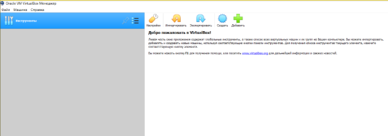{#fig:001 width=70%}

Нажимая "создать", создаю новую виртуальную машину, указываю ее имя, путь к папке машины по умолчанию меня устраивает, выбираю тип ОС и версию (рис. @fig:002).

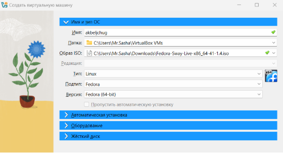{#fig:002 width=70%}

Указываю объем основной памяти виртуальной машины размером 4096МБ (рис. @fig:003).

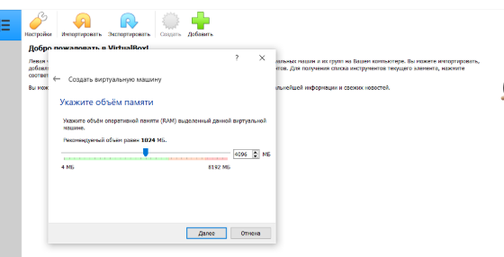{#fig:003 width=70%}

Выбираю создание нового виртуального жесткого диска (рис. @fig:004).

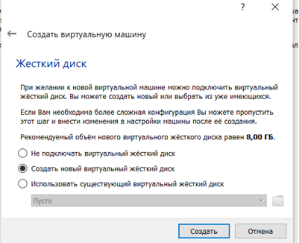{#fig:004 width=70%}

Задаю конфигурацию жесткого диска: загрузочеый VDI (рис. @fig:005).

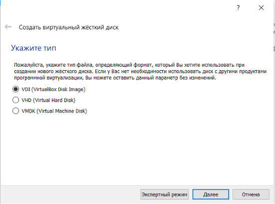{#fig:005 width=70%}

Задаю размер диска - 80 ГБ, оставляю расположение жесткого диска по умолчанию, т. к. работаю на собственной технике и значение по умолчанию меня устраивает (рис. @fig:006).

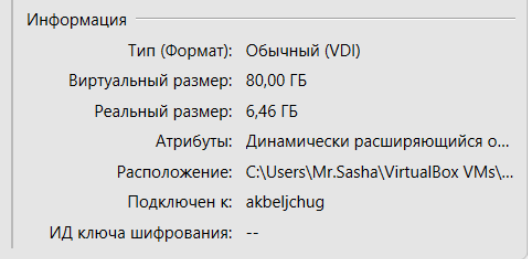{#fig:006 width=70%}

Выбираю динамический виртуальный жесткого диска при указании формата хранения (рис. @fig:007).

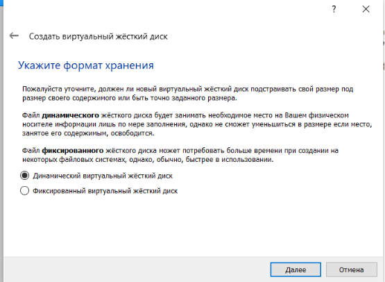{#fig:007 width=70%}

Выбираю в Virtualbox настройку своей виртуальной машины. Перехожу в "Носители", добавляю новый привод привод оптических дисков и выбираю скачанный образ операционной системы Fedora (рис. @fig:008).

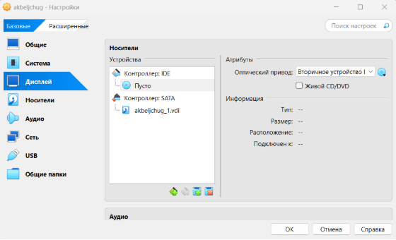{#fig:008 width=70%}

Скачанный образ ОС был успешно выбран (рис. @fig:009).

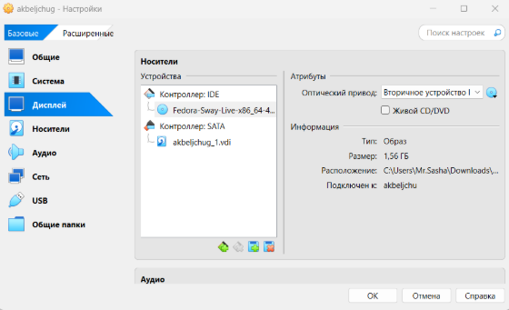{#fig:009 width=70%}

## Установка операционной системы

Запускаю созданную виртуальную машину для установки (рис. @fig:010).

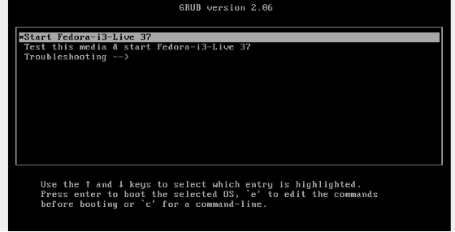{#fig:010 width=70%}

Вижу интерфейс начальной конфигурации. Нажимаю Enter для создания конфигурации по умолчанию, далее нажимаю Enter, чтобы выбрать в качестве модификатора кливишу Win (рис. @fig:011).

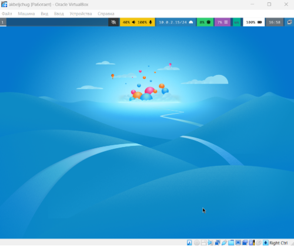{#fig:011 width=70%}

Нажимаю Win+Enter для запуска терминала. В терминале запускаю liveinst (рис. @fig:012).

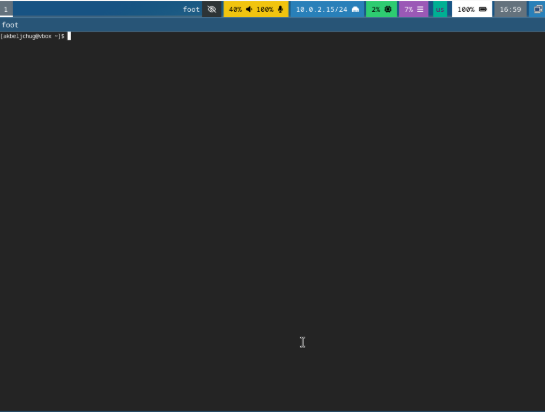{#fig:012 width=70%}

Чтобы перейти к раскладке окон с табами, нажимаю Win+w. Выбираю язык для использования в процессе установки русски (рис. @fig:013).

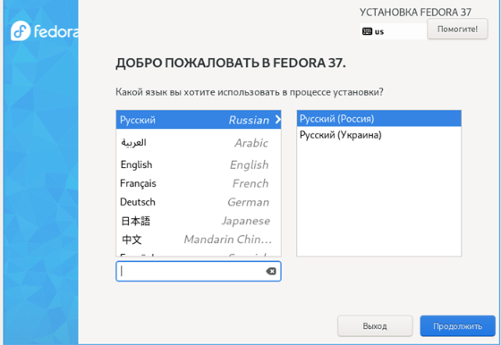{#fig:013 width=70%}

Раскладку клавиатуры выбираю и русскую, и английскую (рис. @fig:014).

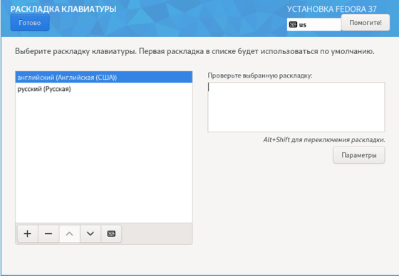{#fig:014 width=70%}

Проверяю место установки и сохраняю значение по умолчанию (рис. @fig:016).

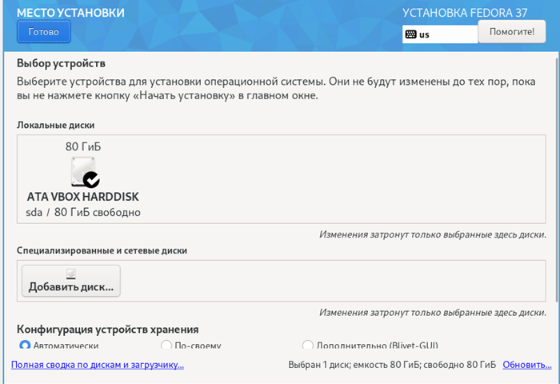{#fig:015 width=70%}

Создаю аккаунт администратора и создаю пароль для супер-пользователя (рис. @fig:018).

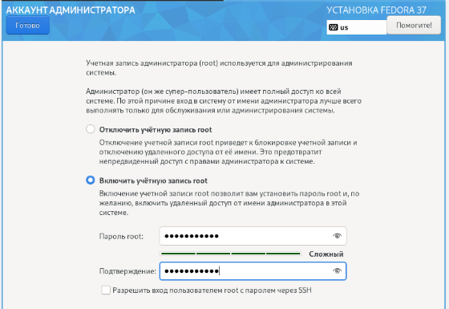{#fig:016 width=70%}

## Работа с операционной системой после установки

Нажимаю Win+Enter для запуска терминала и переключаюсь на роль супер-пользователя(рис. @fig:024).

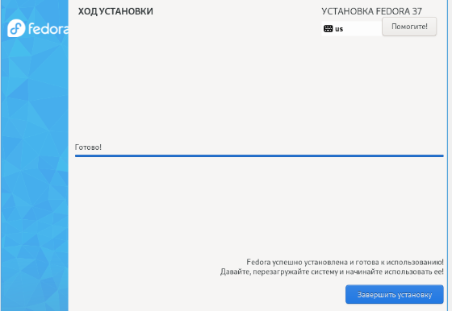{#fig:017 width=70%}

Обновляю все пакеты (рис. @fig:025).

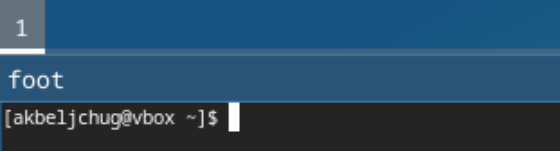{#fig:018 width=70%}

Устанавливаю программы для удобства работы в концсоли: tmux для открытия нескольких "вкладок" в одном терминале, mc в качестве файлового менеджера в терминале (рис. @fig:026).

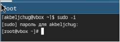{#fig:019 width=70%}

Устанавливаю программы для автоматического обновления (рис. @fig:027).

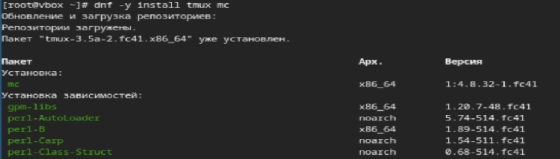{#fig:020 width=70%}

Запускаю таймер (рис. @fig:028).

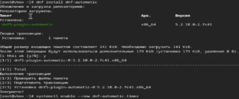{#fig:021 width=70%}

Перемещаюсь в директорию /etc/selinux, открываю md, ищу нужный файл (рис. @fig:029).

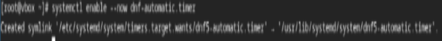{#fig:022 width=70%}

Изменяю открытый файл: SELINUX=enforcing меняю на значение SELINUX=permissive (рис. @fig:030).

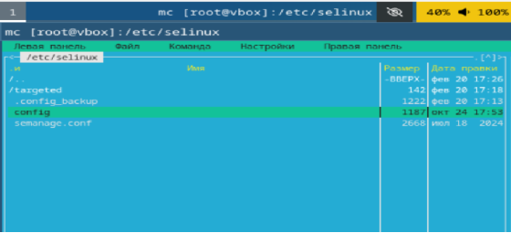{#fig:023 width=70%}

Перезагружаю виртуальную машину (рис. @fig:031).

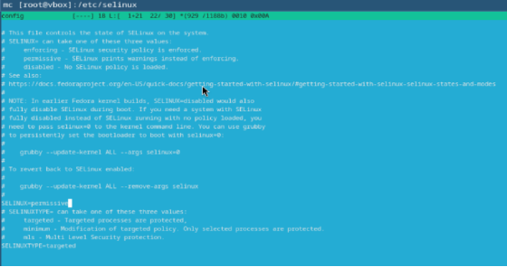{#fig:024 width=70%}

Снова вхожу в ОС, снова запускаю терминал, запускюа терминальный мультиплексор (рис. @fig:032).

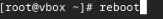{#fig:025 width=70%}

Переключаюсь на роль супер-пользователя (рис. @fig:033).

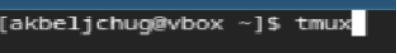{#fig:026 width=70%}

Создание крнфигурационный файл (рис. @fig:034).

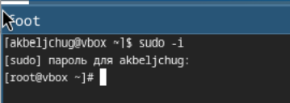{#fig:027 width=70%}

Отредактируйте конфигурационный файл (рис. @fig:035).

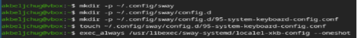{#fig:028 width=70%}

Перехожу в директорию /tc/X11/xorg.conf.d, открываю mc для удобства, открываю файл 00-keyboard.conf (рис. @fig:038).

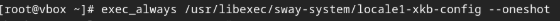{#fig:029 width=70%}

Редактирую конфигурационный файл (рис. @fig:039).

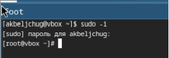{#fig:030 width=70%}

Перезагружаю виртуальную машину (рис. @fig:040).

{#fig:031 width=70%}

## Установка программного обеспечения для создания документации

Запускаю терминал. Запускаю терминальный мультиплексор tmux, переключаюсь на роль супер-пользователя (рис. @fig:041).

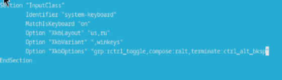{#fig:032 width=70%}

Устанавливаю pandoc с помощью утилиты dnf и флага -y, который автоматически на все вопросы системы отчевает "yes" (рис. @fig:042).

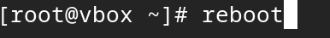{#fig:033 width=70%}

Устанавливаю pandoc-crossref (рис. @fig:043).

{#fig:034 width=70%}

Устанавливаю дистрибутив texlive (рис. @fig:044).

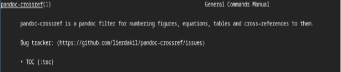{#fig:036 width=70%}

# Выводы

При выполнении данной лабораторной работы я приобрела практические навыки установки операционной системы на виртуальную машину, а так же сделала настройки минимально необходимых для дальнейшей работы сервисов.

# Ответы на контрольные вопросы

1. Учетная запись содержит необходимые для идентификации пользователя при подключении к системе данные, а так же информацию для авторизации и учета: системного имени (user name) (оно может содержать только латинские буквы и знак нижнее подчеркивание, еще оно должно быть уникальным), идентификатор пользователя (UID) (уникальный идентификатор пользователя в системе, целое положительное число), идентификатор группы (CID) (группа, к к-рой относится пользователь. Она, как минимум, одна, по умолчанию - одна), полное имя (full name) (Могут быть ФИО), домашний каталог (home directory) (каталог, в к-рый попадает пользователь после входа в систему и в к-ром хранятся его данные), начальная оболочка (login shell) (командная оболочка, к-рая запускается при входе в систему).

2. Для получения справки по команде: <команда> --help; для перемещения по файловой системе - cd; для просмотра содержимого каталога - ls; для определения объёма каталога - du <имя каталога>; для создания / удаления каталогов - mkdir/rmdir; для создания / удаления файлов - touch/rm; для задания определённых прав на файл / каталог - chmod; для просмотра истории команд - history

3. Файловая система - это порядок, определяющий способ организации и хранения и именования данных на различных носителях информации. Примеры: FAT32 представляет собой пространство, разделенное на три части: олна область для служебных структур, форма указателей в виде таблиц и зона для хранения самих файлов. ext3/ext4 - журналируемая файловая система, используемая в основном в ОС с ядром Linux.

4. С помощью команды df, введя ее в терминале. Это утилита, которая показывает список всех файловых систем по именам устройств, сообщает их размер и данные о памяти. Также посмотреть подмонтированные файловые системы можно с помощью утилиты mount.

5. Чтобы удалить зависший процесс, вначале мы должны узнать, какой у него id: используем команду ps. Далее в терминале вводим команду kill < id процесса >. Или можно использовать утилиту killall, что "убьет" все процессы, которые есть в данный момент, для этого не нужно знать id процесса.

# Выполнение дополнительного задания

Ввожу в терминале команду dmesg, чтобы проанализировать последовательность загрузки системы (рис. @fig:045).

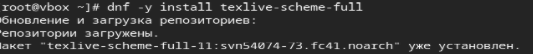{#fig:037 width=70%}

С помощью поиска, осуществляемого командой 'dmesg | grep -i <что ищем>', ищу версию ядра Linux: 6.1.10-200.fc37.x86_64 (рис. @fig:046).

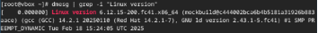{#fig:039 width=70%}

К сожалению, если вводить "Detected Mhz processor" там, где нужно указывать, что я ищу, то мне ничего не выведется. Это происходит потому, что запрос не предусматривает дополнительные символы внутри него (я проверяла, будет ли работать он с маской - не будет). В таком случае я оставила одно из ключевых слов (могла оставить два: "Mhz processor") и получила результат: 1992 Mhz (рис. @fig:047).

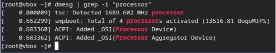{#fig:040 width=70%}

Аналогично ищу модель процессора (рис. @fig:048).

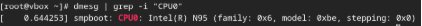{#fig:041 width=70%}

Объем доступной оперативной памяти ищу аналогично поиску частоты процессора, т. к. возникла та же проблема, что и там (рис. @fig:041).

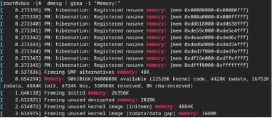{#fig:042 width=70%}

Нахожу тип обнаруженного гипервизора (рис. @fig:041).

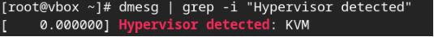{#fig:043 width=70%}

Тип файловой системы корневого раздела можно посомтреть с помощью утилиты fdisk (рис. @fig:042).

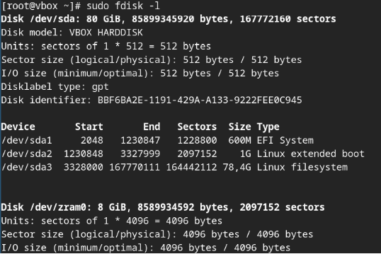{#fig:044 width=70%}

Последовательность монтирования файловых систем можно посмотреть, введя в поиск по результату dmesg слово mount (рис. @fig:043).

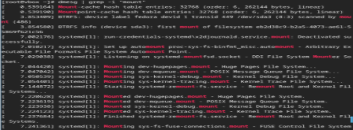{#fig:045 width=70%}

:::
